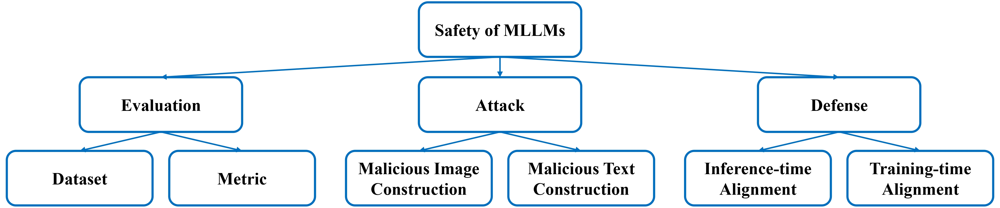

# Awesome-MLLM-Safety [](https://github.com/isXinLiu/Awesome-MLLM-Safety)
A collection (won't be updated) of papers related to safety of Multimodal Large Language Models (MLLMs).

We follow the definition of safety from the paper <b><q>Safety-Tuned LLaMAs: Lessons From Improving the Safety of Large Language Models that Follow Instructions</q></b>: <blockquote>Safety is defined as stopping models from following malicious instructions and <b>generating toxic content</b>.</blockquote>

<details>
  <summary>The scope of our collection.</summary>
  <ul>
    <li>
      Robustness-related wrong prediction and downstream applications (e.g., robotic/medical/legal/financial domains, anomalies detection, fake news detection) are not involved.
    </li>
    <li>
      We care about the safety of <b>MLLMs</b>, excluding other models like text-to-image models.
    </li>
    <li>
      We mainly focus on <b>images and text</b>, and few about other modalities like audio and videos.
    </li>
  </ul>
</details>


> If you find some important work missed, it would be super helpful to let me know (`isXinLiu@gmail.com`). Thanks!

> If you find our survey useful for your research, please consider citing:

```
@article{liu:arxiv2024,
  title={Safety of Multimodal Large Language Models on Images and Text},
  author={Liu, Xin and Zhu, Yichen and Lan, Yunshi and Yang, Chao and Qiao, Yu},
  journal={arXiv preprint arXiv:2402.00357},
  year={2024}
}
```

Common terminologies related to safety:

Taxonomy----safety of MLLMs on images and text:


**Table of Contents**
- [Evaluation](#Evaluation)
- [Attack](#Attack)
- [Defense](#Defense)
- [Other](#Other)
---

## Evaluation
* **The Phantom Menace: Unmasking Privacy Leakages in Vision-Language Models**
  * Simone Caldarella, Massimiliano Mancini, Elisa Ricci, Rahaf Aljundi
  * University of Trento | Toyota Motor Europe | Fondazione Bruno Kessler
  * [2024.08.02] https://arxiv.org/abs/2408.01228
  * A finding
* **Granular Privacy Control for Geolocation with Vision Language Models** | [Github](https://github.com/ethanm88/GPTGeoChat) 
  * Ethan Mendes, Yang Chen, James Hays, Sauvik Das, Wei Xu, Alan Ritter
  * Georgia Tech | CMU
  * [2024.07.06] https://arxiv.org/abs/2407.04952
  * Benchmark
* **VIVA: A Benchmark for Vision-Grounded Decision-Making with Human Values**
  * Zhe Hu, Yixiao Ren, Jing Li, Yu Yin
  * The Hong Kong Polytechnic University | Case Western Reserve University
  * [2024.07.03] https://arxiv.org/abs/2407.03000
  * Benchmark
* **MOSSBench: Is Your Multimodal Language Model Oversensitive to Safe Queries?** | [Github](https://github.com/xirui-li/MOSSBench) 
  * Xirui Li, Hengguang Zhou, Ruochen Wang, Tianyi Zhou, Minhao Cheng, Cho-Jui Hsieh
  * University of California | University of Maryland | Pennsylvania State University
  * [2024.06.22] https://arxiv.org/abs/2406.17806
  * Benchmark
* **Cross-Modality Safety Alignment** | [Github](https://github.com/sinwang20/SIUO) 
  * Siyin Wang, Xingsong Ye, Qinyuan Cheng, Junwen Duan, Shimin Li, Jinlan Fu, Xipeng Qiu, Xuanjing Huang
  * Fudan University | National University of Singapore | Shanghai AI Laboratory
  * [2024.06.21] https://arxiv.org/abs/2406.15279
  * Benchmark
* **MLLMGuard: A Multi-dimensional Safety Evaluation Suite for Multimodal Large Language Models** | [Github](https://github.com/Carol-gutianle/MLLMGuard) 
  * Tianle Gu, Zeyang Zhou, Kexin Huang, Dandan Liang, Yixu Wang, Haiquan Zhao, Yuanqi Yao, Xingge Qiao, Keqing Wang, Yujiu Yang, Yan Teng, Yu Qiao, Yingchun Wang
  * Tsinghua University | Shanghai Artificial Intelligence Laboratory
  * [2024.06.11] https://arxiv.org/abs/2406.07594
  * Benchmark
* **Benchmarking Trustworthiness of Multimodal Large Language Models: A Comprehensive Study** | [Github](https://github.com/thu-ml/MMTrustEval) 
  * Yichi Zhang, Yao Huang, Yitong Sun, Chang Liu, Zhe Zhao, Zhengwei Fang, Yifan Wang, Huanran Chen, Xiao Yang, Xingxing Wei, Hang Su, Yinpeng Dong, Jun Zhu
  * Tsinghua University | Beihang University |  Shanghai Jiao Tong University | RealAI
  * [2024.06.11] https://arxiv.org/abs/2406.07057
  * Benchmark
* **CARES: A Comprehensive Benchmark of Trustworthiness in Medical Vision Language Models** | [Github](https://github.com/richard-peng-xia/CARES) 
  * Peng Xia, Ze Chen, Juanxi Tian, Yangrui Gong, Ruibo Hou, Yue Xu, Zhenbang Wu, Zhiyuan Fan, Yiyang Zhou, Kangyu Zhu, Wenhao Zheng, Zhaoyang Wang, Xiao Wang, Xuchao Zhang, Chetan Bansal, Marc Niethammer, Junzhou Huang, Hongtu Zhu, Yun Li, Jimeng Sun, Zongyuan Ge, Gang Li, James Zou, Huaxiu Yao
  * UNC-Chapel Hill | UIUC | Brown University | University of Washington | Microsoft Research | UT Arlington | Monash University | Stanford University
  * [2024.06.10] https://arxiv.org/abs/2406.06007
  * Benchmark
* **ToxVidLLM: A Multimodal LLM-based Framework for Toxicity Detection in Code-Mixed Videos** | [Github](https://github.com/justaguyalways/ToxVidLM_ACL_2024) 
  * Krishanu Maity, A.S. Poornash, Sriparna Saha, Pushpak Bhattacharyya
  * Indian Institute of Technology Patna | Indian Institute of Technology Bombay
  * [2024.05.31] https://arxiv.org/abs/2405.20628
  * Benchmark
* **AutoBreach: Universal and Adaptive Jailbreaking with Efficient Wordplay-Guided Optimization**
  * Jiawei Chen, Xiao Yang, Zhengwei Fang, Yu Tian, Yinpeng Dong, Zhaoxia Yin, Hang Su
  * East China Normal University | Tsinghua University | RealAI
  * [2024.05.30] https://arxiv.org/abs/2405.19668
  * Benchmark
* **Privacy-Aware Visual Language Models**
  * Laurens Samson, Nimrod Barazani, Sennay Ghebreab, Yuki M. Asano
  * University of Amsterdam
  * [2024.05.27] https://arxiv.org/abs/2405.17423
  * Defense, Benchmark
* **Cross-Modality Jailbreak and Mismatched Attacks on Medical Multimodal Large Language Models** | [Github](https://github.com/dirtycomputer/O2M_attack) 
  * Xijie Huang, Xinyuan Wang, Hantao Zhang, Jiawen Xi, Jingkun An, Hao Wang, Chengwei Pan
  * Beihang University | University of Science and Technology of China
  * [2024.05.26] https://arxiv.org/abs/2405.20775
  * Attack, Benchmark
* **More Distinctively Black and Feminine Faces Lead to Increased Stereotyping in Vision-Language Models**
  * Messi H.J. Lee, Jacob M. Montgomery, Calvin K. Lai
  * Washington University in St. Louis
  * [2024.05.22] https://arxiv.org/abs/2407.06194
  * A finding
* **Learning To See But Forgetting To Follow: Visual Instruction Tuning Makes LLMs More Prone To Jailbreak Attacks** | [Github](https://github.com/gpantaz/vl_jailbreak) 
  * Georgios Pantazopoulos, Amit Parekh, Malvina Nikandrou, Alessandro Suglia
  * Heriot-Watt University
  * [2024.05.07] https://arxiv.org/abs/2405.04403
  * A finding
* **Private Attribute Inference from Images with Vision-Language Models**
  * Batuhan Tömekçe, Mark Vero, Robin Staab, Martin Vechev
  * ETH Zurich
  * [2024.04.16] https://arxiv.org/abs/2404.10618
  * Benchmark
* **Red Teaming GPT-4V: Are GPT-4V Safe Against Uni/Multi-Modal Jailbreak Attacks?**
  * Shuo Chen, Zhen Han, Bailan He, Zifeng Ding, Wenqian Yu, Philip Torr, Volker Tresp, Jindong Gu
  * LMU Munich | University of Oxford | Siemens AG | MCML | Wuhan University
  * [2024.04.04] https://arxiv.org/abs/2404.03411
  * Benchmark
* **JailBreakV-28K: A Benchmark for Assessing the Robustness of MultiModal Large Language Models against Jailbreak Attacks** | [Github](https://github.com/EddyLuo1232/JailBreakV_28K) 
  * Weidi Luo, Siyuan Ma, Xiaogeng Liu, Xiaoyu Guo, Chaowei Xiao
  * The Ohio State University | University of Wisconsin-Madison
  * [2024.04.03] https://arxiv.org/abs/2404.03027
  * Benchmark
* **Uncovering Bias in Large Vision-Language Models with Counterfactuals**
  * Phillip Howard, Anahita Bhiwandiwalla, Kathleen C. Fraser, Svetlana Kiritchenko
  * Intel Labs | National Research Council Canada
  * [2024.03.29] https://arxiv.org/abs/2404.00166
  * Analysis
* **Assessment of Multimodal Large Language Models in Alignment with Human Values** | [Github](https://github.com/OpenGVLab/LAMM) 
  * Zhelun Shi, Zhipin Wang, Hongxing Fan, Zaibin Zhang, Lijun Li, Yongting Zhang, Zhenfei Yin, Lu Sheng, Yu Qiao, Jing Shao
  * Shanghai Artificial Intelligence Laboratory | School of Software, Beihang University | Dalian University of Technology | University of Science and Technology of China | The University of Sydney
  * [2024.03.26] https://arxiv.org/abs/2403.17830
  * Benchmark
* **Evaluating the Efficacy of Prompt-Engineered Large Multimodal Models Versus Fine-Tuned Vision Transformers in Image-Based Security Applications**
  * Fouad Trad, Ali Chehab
  * American University of Beirut
  * [2024.03.26] https://arxiv.org/abs/2403.17787
  * Analysis
* **AVIBench: Towards Evaluating the Robustness of Large Vision-Language Model on Adversarial Visual-Instructions**
  * Hao Zhang, Wenqi Shao, Hong Liu, Yongqiang Ma, Ping Luo, Yu Qiao, Kaipeng Zhang
  * Xi'an Jiaotong University | Shanghai Artificial Intelligence Laboratory | Osaka University
  * [2024.03.14] https://arxiv.org/abs/2403.09346
  * Benchmark
* **Prismatic VLMs: Investigating the Design Space of Visually-Conditioned Language Models** | [Github](https://github.com/TRI-ML/prismatic-vlms) 
  * Siddharth Karamcheti, Suraj Nair, Ashwin Balakrishna, Percy Liang, Thomas Kollar, Dorsa Sadigh
  * Stanford | Toyota Research Institute
  * [2024.02.12] https://arxiv.org/abs/2402.07865
  * Insights
* **HarmBench: A Standardized Evaluation Framework for Automated Red Teaming and Robust Refusal** | [Github](https://github.com/centerforaisafety/HarmBench) 
  * Mantas Mazeika, Long Phan, Xuwang Yin, Andy Zou, Zifan Wang, Norman Mu, Elham Sakhaee, Nathaniel Li, Steven Basart, Bo Li, David Forsyth, Dan Hendrycks
  * University of Illinois Urbana-Champaign | Center for AI Safety | Carnegie Mellon University | UC Berkeley | Microsoft
  * [2024.02.06] https://arxiv.org/abs/2402.04249
  * Benchmark
* **Safety Fine-Tuning at (Almost) No Cost: A Baseline for Vision Large Language Models** | [Github](https://github.com/ys-zong/VLGuard) 
  * Yongshuo Zong, Ondrej Bohdal, Tingyang Yu, Yongxin Yang, Timothy Hospedales
  * University of Edinburgh | EPFL
  * [2024.02.03] https://arxiv.org/abs/2402.02207
  * Defense, Benchmark
* **Red Teaming Visual Language Models**
  * Mukai Li, Lei Li, Yuwei Yin, Masood Ahmed, Zhenguang Liu, Qi Liu
  * The University of Hong Kong | Zhejiang University
  * [2024.01.23] https://arxiv.org/abs/2401.12915
  * Benchmark
* **InferAligner: Inference-Time Alignment for Harmlessness through Cross-Model Guidance** | [Github](https://github.com/Jihuai-wpy/InferAligner) 
  * Pengyu Wang, Dong Zhang, Linyang Li, Chenkun Tan, Xinghao Wang, Ke Ren, Botian Jiang, Xipeng Qiu
  * Fudan University
  * [2024.01.20] https://arxiv.org/abs/2401.11206
  * Defense, Benchmark
* **GOAT-Bench: Safety Insights to Large Multimodal Models through Meme-Based Social Abuse**
  * Hongzhan Lin, Ziyang Luo, Bo Wang, Ruichao Yang, Jing Ma
  * Hong Kong Baptist University
  * [2024.01.03] https://arxiv.org/abs/2401.01523
  * Benchmark
* **ToViLaG: Your Visual-Language Generative Model is Also An Evildoer**
  * Xinpeng Wang, Xiaoyuan Yi, Han Jiang, Shanlin Zhou, Zhihua Wei, Xing Xie
  * Tongji University | Microsoft Research Asia
  * [2023.12.13] https://arxiv.org/abs/2312.11523v1
  * Benchmark
* **MM-SafetyBench: A Benchmark for Safety Evaluation of Multimodal Large Language Models** | [Github](https://github.com/isXinLiu/MM-SafetyBench) 
  * Xin Liu, Yichen Zhu, Jindong Gu, Yunshi Lan, Chao Yang, Yu Qiao
  * East China Normal University | Midea Group | Shanghai AI Laboratory
  * [2023.11.29] https://arxiv.org/abs/2311.17600
  * Attack, Benchmark
* **Large Language Models as Automated Aligners for benchmarking Vision-Language Models**
  * Yuanfeng Ji, Chongjian Ge, Weikai Kong, Enze Xie, Zhengying Liu, Zhengguo Li, Ping Luo
  * The University of Hong Kong | Huawei Noah's Ark Lab
  * [2023.11.24] https://arxiv.org/abs/2311.14580
  * Benchmark
* **DRESS: Instructing Large Vision-Language Models to Align and Interact with Humans via Natural Language Feedback**
  * Yangyi Chen, Karan Sikka, Michael Cogswell, Heng Ji, Ajay Divakaran
  * SRI International | University of Illinois Urbana-Champaign
  * [2023.11.16] https://arxiv.org/abs/2311.10081
  * Defense, Benchmark
* **FigStep: Jailbreaking Large Vision-language Models via Typographic Visual Prompts** | [Github](https://github.com/ThuCCSLab/FigStep) 
  * Yichen Gong, Delong Ran, Jinyuan Liu, Conglei Wang, Tianshuo Cong, Anyu Wang, Sisi Duan, Xiaoyun Wang
  * Tsinghua University | Shandong University | Carnegie Mellon University
  * [2023.11.09] https://arxiv.org/abs/2311.05608
  * Attack, Benchmark
* **Fine-tuning Aligned Language Models Compromises Safety, Even When Users Do Not Intend To!** | [Github](https://github.com/LLM-Tuning-Safety/LLMs-Finetuning-Safety) 
  * Xiangyu Qi, Yi Zeng, Tinghao Xie, Pin-Yu Chen, Ruoxi Jia, Prateek Mittal, Peter Henderson
  * Princeton University | Virginia Tech | IBM Research | Stanford University
  * [2023.10.05] https://arxiv.org/abs/2310.03693
  * A finding
* **Can Language Models be Instructed to Protect Personal Information?** | [Github](https://github.com/ethanm88/llm-access-control) 
  * Yang Chen, Ethan Mendes, Sauvik Das, Wei Xu, Alan Ritter
  * Georgia Institute of Technology | Carnegie Mellon University
  * [2023.10.03] https://arxiv.org/abs/2310.02224
  * Attack, Defense, Benchmark
## Attack
* **Arondight: Red Teaming Large Vision Language Models with Auto-generated Multi-modal Jailbreak Prompts**
  * Yi Liu, Chengjun Cai, Xiaoli Zhang, Xingliang Yuan, Cong Wang
  * City University of Hong Kong | City University of Hong Kong (Dongguan) | University of Science and Technology Beijing | The University of Melbourne
  * [2024.07.21] https://arxiv.org/abs/2407.15050
  * Attack
* **When Do Universal Image Jailbreaks Transfer Between Vision-Language Models?**
  * Rylan Schaeffer, Dan Valentine, Luke Bailey, James Chua, Cristóbal Eyzaguirre, Zane Durante, Joe Benton, Brando Miranda, Henry Sleight, John Hughes, Rajashree Agrawal, Mrinank Sharma, Scott Emmons, Sanmi Koyejo, Ethan Perez
  * Stanford CS | Harvard SEAS | Anthropic | Constellation | MIT EECS | UC Berkeley EECS
  * [2024.07.21] https://arxiv.org/abs/2407.15211
  * Attack
* **Sim-CLIP: Unsupervised Siamese Adversarial Fine-Tuning for Robust and Semantically-Rich Vision-Language Models**
  * Md Zarif Hossain, Ahmed Imteaj
  * Southern Illinois University | Security, Privacy and Intelligence for Edge Devices Laboratory (SPEED Lab)
  * [2024.07.20] https://arxiv.org/abs/2407.14971
  * Attack
* **Refusing Safe Prompts for Multi-modal Large Language Models** | [Github](https://github.com/Sadcardation/MLLM-Refusal) 
  * Zedian Shao, Hongbin Liu, Yuepeng Hu, Neil Zhenqiang Gong
  * Duke University
  * [2024.07.12] https://arxiv.org/abs/2407.09050
  * Attack
* **Image-to-Text Logic Jailbreak: Your Imagination can Help You Do Anything**
  * Xiaotian Zou, Yongkang Chen
  *  University of Exeter | Nanjing University of Aeronautics and Astronautics
  * [2024.07.01] https://arxiv.org/abs/2407.02534
  * Attack
* **Adversarial Attacks on Multimodal Agents** | [Github](https://github.com/ChenWu98/agent-attack) 
  * Chen Henry Wu, Jing Yu Koh, Ruslan Salakhutdinov, Daniel Fried, Aditi Raghunathan
  * Carnegie Mellon University
  * [2024.06.18] https://arxiv.org/abs/2406.12814
  * Attack
* **Unveiling the Safety of GPT-4o: An Empirical Study using Jailbreak Attacks** | [Github](https://github.com/NY1024/Jailbreak_GPT4o) 
  * Zonghao Ying, Aishan Liu, Xianglong Liu, Dacheng Tao
  * Beihang University | Nanyang Technological University
  * [2024.06.10] https://arxiv.org/abs/2406.06302
  * Attack
* **Jailbreak Vision Language Models via Bi-Modal Adversarial Prompt** | [Github](https://github.com/NY1024/BAP-Jailbreak-Vision-Language-Models-via-Bi-Modal-Adversarial-Prompt) 
  * Zonghao Ying, Aishan Liu, Tianyuan Zhang, Zhengmin Yu, Siyuan Liang, Xianglong Liu, Dacheng Tao
  * Beihang University | Fudan University | National University of Singapore | Nanyang Technological University
  * [2024.06.06] https://arxiv.org/abs/2406.04031
  * Attack
* **Exploring the Robustness of Decision-Level Through Adversarial Attacks on LLM-Based Embodied Models**
  * Shuyuan Liu, Jiawei Chen, Shouwei Ruan, Hang Su, Zhaoxia Yin
  * East China Normal University | Beihang University | Tsinghua University
  * [2024.05.30] https://arxiv.org/abs/2405.19802
  * Attack(Robot)
* **Typography Leads Semantic Diversifying: Amplifying Adversarial Transferability across Multimodal Large Language Models**
  * Hao Cheng, Erjia Xiao, Jiahang Cao, Le Yang, Kaidi Xu, Jindong Gu, Renjing Xu
  * HKUST (GZ) | Xi'an Jiaotong University | Drexel University | Oxford University
  * [2024.05.30] https://arxiv.org/abs/2405.20090
  * Attack
* **Efficient LLM-Jailbreaking by Introducing Visual Modality** | [Github](https://github.com/abc321123444/LLM-jb) 
  * Zhenxing Niu, Yuyao Sun, Haodong Ren, Haoxuan Ji, Quan Wang, Xiaoke Ma, Gang Hua, Rong Jin
  * Xidian University | Xi'an Jiaotong University | Wormpex AI Research | Meta
  * [2024.05.30] https://arxiv.org/abs/2405.20015
  * Attack
* **White-box Multimodal Jailbreaks Against Large Vision-Language Models**
  * Ruofan Wang, Xingjun Ma, Hanxu Zhou, Chuanjun Ji, Guangnan Ye, Yu-Gang Jiang
  * Fudan University |  Shanghai Jiao Tong University | DataGrand Tech
  * [2024.05.28] https://arxiv.org/abs/2405.17894
  * Attack
* **Cross-Modality Jailbreak and Mismatched Attacks on Medical Multimodal Large Language Models** | [Github](https://github.com/dirtycomputer/O2M_attack) 
  * Xijie Huang, Xinyuan Wang, Hantao Zhang, Jiawen Xi, Jingkun An, Hao Wang, Chengwei Pan
  * Beihang University | University of Science and Technology of China
  * [2024.05.26] https://arxiv.org/abs/2405.20775
  * Attack, Benchmark
* **Visual-RolePlay: Universal Jailbreak Attack on MultiModal Large Language Models via Role-playing Image Characte**
  * Siyuan Ma, Weidi Luo, Yu Wang, Xiaogeng Liu, Muhao Chen, Bo Li, Chaowei Xiao
  * Peking University | The Ohio State University | University of Wisconsin-Madison | University of California | The University of Chicago
  * [2024.05.25] https://arxiv.org/abs/2405.20773
  * Attack
* **Composite Backdoor Attacks Against Large Language Models** | [Github](https://github.com/MiracleHH/CBA) 
  * Hai Huang, Zhengyu Zhao, Michael Backes, Yun Shen, Yang Zhang
  * CISPA Helmholtz Center for Information Security | Xi'an Jiaotong University | NetApp
  * [2024.03.30] https://arxiv.org/abs/2310.07676
  * Attack
* **Images are Achilles' Heel of Alignment: Exploiting Visual Vulnerabilities for Jailbreaking Multimodal Large Language Models**
  * Yifan Li, Hangyu Guo, Kun Zhou, Wayne Xin Zhao, Ji-Rong Wen
  * Renmin University | Beijing Key Laboratory of Big Data Management and Analysis Methods
  * [2024.03.14] https://arxiv.org/abs/2403.09792
  * Attack
* **ImgTrojan: Jailbreaking Vision-Language Models with ONE Image** | [Github](https://github.com/xijia-tao/ImgTrojan) 
  * Xijia Tao, Shuai Zhong, Lei Li, Qi Liu, Lingpeng Kong
  * The University of Hong Kong
  * [2024.03.05] https://arxiv.org/abs/2403.02910
  * Attack
* **The Wolf Within: Covert Injection of Malice into MLLM Societies via an MLLM Operative** | [Github](https://github.com/ChengshuaiZhao0/The-Wolf-Within) 
  * Zhen Tan, Chengshuai Zhao, Raha Moraffah, Yifan Li, Yu Kong, Tianlong Chen, Huan Liu
  * Arizona State University | Michigan State University | MIT
  * [2024.02.20] https://arxiv.org/abs/2402.14859
  * Attack(Agent)
* **Exploiting Alpha Transparency In Language And Vision-Based AI Systems**
  * David Noever, Forrest McKee
  * PeopleTec
  * [2024.02.15] https://arxiv.org/abs/2402.09671
  * Attack
* **Test-Time Backdoor Attacks on Multimodal Large Language Models** | [Github](https://github.com/sail-sg/AnyDoor) 
  * Dong Lu, Tianyu Pang, Chao Du, Qian Liu, Xianjun Yang, Min Lin
  * Southern University of Science and Technology | Sea AI Lab | University of California
  * [2024.02.13] https://arxiv.org/abs/2402.08577
  * Attack
* **Agent Smith: A Single Image Can Jailbreak One Million Multimodal LLM Agents Exponentially Fast** | [Github](https://github.com/sail-sg/Agent-Smith) 
  * Xiangming Gu, Xiaosen Zheng, Tianyu Pang, Chao Du, Qian Liu, Ye Wang, Jing Jiang, Min Lin
  * Sea AI Lab | National University of Singapore | Singapore Management University
  * [2024.02.13] https://arxiv.org/abs/2402.08567
  * Attack(Agent)
* **Shadowcast: Stealthy Data Poisoning Attacks Against Vision-Language Models** | [Github](https://github.com/umd-huang-lab/VLM-Poisoning) 
  * Yuancheng Xu, Jiarui Yao, Manli Shu, Yanchao Sun, Zichu Wu, Ning Yu, Tom Goldstein, Furong Huang
  * University of Maryland, College Park | JPMorgan AI Research | University of Waterloo | Salesforce Research
  * [2024.02.05] https://arxiv.org/abs/2402.06659
  * Attack
* **GUARD: Role-playing to Generate Natural-language Jailbreakings to Test Guideline Adherence of Large Language Models**
  * Haibo Jin, Ruoxi Chen, Andy Zhou, Jinyin Chen, Yang Zhang, Haohan Wang
  * University of Illinois at Urbana-Champaign | Zhejiang University of Technology | Lapis Labs
  * [2024.02.05] https://arxiv.org/abs/2402.03299
  * Attack
* **Jailbreaking Attack against Multimodal Large Language Model**
  * Zhenxing Niu, Haodong Ren, Xinbo Gao, Gang Hua, Rong Jin
  * Xidian University | Wormpex AI Research | Meta
  * [2024.02.04] https://arxiv.org/abs/2402.02309
  * Attack
* **An Image Is Worth 1000 Lies: Transferability of Adversarial Images across Prompts on Vision-Language Models** | [Github](https://github.com/Haochen-Luo/CroPA) 
  * Haochen Luo, Jindong Gu, Fengyuan Liu, Philip Torr
  * University of Oxford
  * [2024.01.16] https://arxiv.org/abs/2403.09766
  * Attack
* **MM-SafetyBench: A Benchmark for Safety Evaluation of Multimodal Large Language Models** | [Github](https://github.com/isXinLiu/MM-SafetyBench) 
  * Xin Liu, Yichen Zhu, Jindong Gu, Yunshi Lan, Chao Yang, Yu Qiao
  * East China Normal University | Midea Group | Shanghai AI Laboratory
  * [2023.11.29] https://arxiv.org/abs/2311.17600
  * Attack, Benchmark
* **How Many Unicorns Are in This Image? A Safety Evaluation Benchmark for Vision LLMs** | [Github](https://github.com/UCSC-VLAA/vllm-safety-benchmark) 
  * Haoqin Tu, Chenhang Cui, Zijun Wang, Yiyang Zhou, Bingchen Zhao, Junlin Han, Wangchunshu Zhou, Huaxiu Yao, Cihang Xie
  * UC Santa Cruz | UNC-Chapel Hill | University of Edinburgh | University of Oxford | AIWaves Inc
  * [2023.11.27] https://arxiv.org/abs/2311.16101
  * Attack
* **Jailbreaking GPT-4V via Self-Adversarial Attacks with System Prompts**
  * Yuanwei Wu, Xiang Li, Yixin Liu, Pan Zhou, Lichao Sun
  * Huazhong University of Science and Technology | Lehigh University
  * [2023.11.15] https://arxiv.org/abs/2311.09127
  * Attack, Defense
* **FigStep: Jailbreaking Large Vision-language Models via Typographic Visual Prompts** | [Github](https://github.com/ThuCCSLab/FigStep) 
  * Yichen Gong, Delong Ran, Jinyuan Liu, Conglei Wang, Tianshuo Cong, Anyu Wang, Sisi Duan, Xiaoyun Wang
  * Tsinghua University | Shandong University | Carnegie Mellon University
  * [2023.11.09] https://arxiv.org/abs/2311.05608
  * Attack, Benchmark
* **Misusing Tools in Large Language Models With Visual Adversarial Examples**
  * Xiaohan Fu, Zihan Wang, Shuheng Li, Rajesh K. Gupta, Niloofar Mireshghallah, Taylor Berg-Kirkpatrick, Earlence Fernandes
  * University of California San Diego | University of Washington
  * [2023.10.04] https://arxiv.org/abs/2310.03185
  * Attack
* **Can Language Models be Instructed to Protect Personal Information?** | [Github](https://github.com/ethanm88/llm-access-control) 
  * Yang Chen, Ethan Mendes, Sauvik Das, Wei Xu, Alan Ritter
  * Georgia Institute of Technology | Carnegie Mellon University
  * [2023.10.03] https://arxiv.org/abs/2310.02224
  * Attack, Defense, Benchmark
* **How Robust is Google's Bard to Adversarial Image Attacks?** | [Github](https://github.com/thu-ml/Attack-Bard) 
  * Yinpeng Dong, Huanran Chen, Jiawei Chen, Zhengwei Fang, Xiao Yang, Yichi Zhang, Yu Tian, Hang Su, Jun Zhu
  * Tsinghua University | RealAI
  * [2023.09.21] https://arxiv.org/abs/2309.11751
  * Attack
* **Image Hijacks: Adversarial Images can Control Generative Models at Runtime** | [Github](https://github.com/euanong/image-hijacks) 
  * Luke Bailey, Euan Ong, Stuart Russell, Scott Emmons
  * UC Berkeley | Harvard University | University of Cambridge
  * [2023.09.01] https://arxiv.org/abs/2309.00236
  * Attack
* **On the Adversarial Robustness of Multi-Modal Foundation Models**
  * Christian Schlarmann, Matthias Hein
  * University of Tubingen
  * [2023.08.21] https://arxiv.org/abs/2308.10741
  * Attack
* **Jailbreak in pieces: Compositional Adversarial Attacks on Multi-Modal Language Models**
  * Erfan Shayegani, Yue Dong, Nael Abu-Ghazaleh
  * University of California
  * [2023.07.26] https://arxiv.org/abs/2307.14539
  * Attack
* **Abusing Images and Sounds for Indirect Instruction Injection in Multi-Modal LLMs**
  * Eugene Bagdasaryan, Tsung-Yin Hsieh, Ben Nassi, Vitaly Shmatikov
  * Cornell Tech
  * [2023.07.19] https://arxiv.org/abs/2307.10490
  * Attack
* **Are aligned neural networks adversarially aligned?**
  * Nicholas Carlini, Milad Nasr, Christopher A. Choquette-Choo, Matthew Jagielski, Irena Gao, Anas Awadalla, Pang Wei Koh, Daphne Ippolito, Katherine Lee, Florian Tramer, Ludwig Schmidt
  * Google DeepMind | Stanford | University of Washington | ETH Zurich
  * [2023.06.26] https://arxiv.org/abs/2306.15447
  * Attack
* **Visual Adversarial Examples Jailbreak Aligned Large Language Models** | [Github](https://github.com/Unispac/Visual-Adversarial-Examples-Jailbreak-Large-Language-Models) 
  * Xiangyu Qi, Kaixuan Huang, Ashwinee Panda, Peter Henderson, Mengdi Wang, Prateek Mittal
  * Princeton University | Stanford University
  * [2023.06.22] https://arxiv.org/abs/2306.13213
  * Attack
## Defense
* **SPA-VL: A Comprehensive Safety Preference Alignment Dataset for Vision Language Model** | [Github](https://github.com/EchoseChen/SPA-VL-RLHF) 
  * Yongting Zhang, Lu Chen, Guodong Zheng, Yifeng Gao, Rui Zheng, Jinlan Fu, Zhenfei Yin, Senjie Jin, Yu Qiao, Xuanjing Huang, Feng Zhao, Tao Gui, Jing Shao
  * University of Science and Technology of China | Fudan University | Shanghai Artificial Intelligence Laboratory
  * [2024.06.17] https://arxiv.org/abs/2406.12030
  * Defense
* **LLavaGuard: VLM-based Safeguards for Vision Dataset Curation and Safety Assessment** | [Github](https://github.com/ml-research/LlavaGuard) 
  * Lukas Helff, Felix Friedrich, Manuel Brack, Kristian Kersting, Patrick Schramowski
  * TU Darmstadt | DFKI | hessian.AI | Ontocord | Centre for Cognitive Science, Darmstadt
  * [2024.06.07] https://arxiv.org/abs/2406.05113
  * Defense
* **Cross-Modal Safety Alignment: Is textual unlearning all you need?**
  * Trishna Chakraborty, Erfan Shayegani, Zikui Cai, Nael Abu-Ghazaleh, M. Salman Asif, Yue Dong, Amit K. Roy-Chowdhury, Chengyu Song
  * University of California
  * [2024.05.27] https://arxiv.org/abs/2406.02575
  * Defense
* **Privacy-Aware Visual Language Models**
  * Laurens Samson, Nimrod Barazani, Sennay Ghebreab, Yuki M. Asano
  * University of Amsterdam
  * [2024.05.27] https://arxiv.org/abs/2405.17423
  * Defense, Benchmark
* **Safety Alignment for Vision Language Models**
  * Zhendong Liu, Yuanbi Nie, Yingshui Tan, Xiangyu Yue, Qiushi Cui, Chongjun Wang, Xiaoyong Zhu, Bo Zheng
  * Nanjing University | Chongqing University | Alibaba Group | Chinese University of Hong Kong
  * [2024.05.22] https://arxiv.org/abs/2405.13581
  * Defense
* **AdaShield: Safeguarding Multimodal Large Language Models from Structure-based Attack via Adaptive Shield Prompting** | [Github](https://github.com/rain305f/AdaShield) 
  * Yu Wang, Xiaogeng Liu, Yu Li, Muhao Chen, Chaowei Xiao
  * Peking University | University of Wisconsin-Madison | International Digital Economy Academy | University of California, Davis
  * [2024.03.14] https://arxiv.org/abs/2403.09513
  * Defense
* **Eyes Closed, Safety On: Protecting Multimodal LLMs via Image-to-Text Transformation** | [Github](https://github.com/gyhdog99/ECSO) 
  * Yunhao Gou, Kai Chen, Zhili Liu, Lanqing Hong, Hang Xu, Zhenguo Li, Dit-Yan Yeung, James T. Kwok, Yu Zhang
  * Southern University of Science and Technology | Hong Kong University of Science and Technology | Huawei Noah's Ark Lab | Peng Cheng Laboratory
  * [2024.03.14] https://arxiv.org/abs/2403.09572
  * Defense
* **The First to Know: How Token Distributions Reveal Hidden Knowledge in Large Vision-Language Models?** | [Github](https://github.com/Qinyu-Allen-Zhao/LVLM-LP) 
  * Qinyu Zhao, Ming Xu, Kartik Gupta, Akshay Asthana, Liang Zheng, Stephen Gould
  * The Australian National University | Seeing Machines Ltd
  * [2024.03.14] https://arxiv.org/abs/2403.09037
  * Defense
* **Safety Fine-Tuning at (Almost) No Cost: A Baseline for Vision Large Language Models** | [Github](https://github.com/ys-zong/VLGuard) 
  * Yongshuo Zong, Ondrej Bohdal, Tingyang Yu, Yongxin Yang, Timothy Hospedales
  * University of Edinburgh | EPFL
  * [2024.02.03] https://arxiv.org/abs/2402.02207
  * Defense, Benchmark
* **InferAligner: Inference-Time Alignment for Harmlessness through Cross-Model Guidance** | [Github](https://github.com/Jihuai-wpy/InferAligner) 
  * Pengyu Wang, Dong Zhang, Linyang Li, Chenkun Tan, Xinghao Wang, Ke Ren, Botian Jiang, Xipeng Qiu
  * Fudan University
  * [2024.01.20] https://arxiv.org/abs/2401.11206
  * Defense, Benchmark
* **MLLM-Protector: Ensuring MLLM's Safety without Hurting Performance** | [Github](https://github.com/pipilurj/MLLM-protector) 
  * Renjie Pi, Tianyang Han, Yueqi Xie, Rui Pan, Qing Lian, Hanze Dong, Jipeng Zhang, Tong Zhang
  * The Hong Kong University of Science and Technology | University of Illinois at Urbana-Champaign | The Hong Kong Polytechnic University
  * [2024.01.05] https://arxiv.org/abs/2401.02906
  * Defense
* **DRESS: Instructing Large Vision-Language Models to Align and Interact with Humans via Natural Language Feedback**
  * Yangyi Chen, Karan Sikka, Michael Cogswell, Heng Ji, Ajay Divakaran
  * SRI International | University of Illinois Urbana-Champaign
  * [2023.11.16] https://arxiv.org/abs/2311.10081
  * Defense, Benchmark
* **Jailbreaking GPT-4V via Self-Adversarial Attacks with System Prompts**
  * Yuanwei Wu, Xiang Li, Yixin Liu, Pan Zhou, Lichao Sun
  * Huazhong University of Science and Technology | Lehigh University
  * [2023.11.15] https://arxiv.org/abs/2311.09127
  * Attack, Defense
* **Can Language Models be Instructed to Protect Personal Information?** | [Github](https://github.com/ethanm88/llm-access-control) 
  * Yang Chen, Ethan Mendes, Sauvik Das, Wei Xu, Alan Ritter
  * Georgia Institute of Technology | Carnegie Mellon University
  * [2023.10.03] https://arxiv.org/abs/2310.02224
  * Attack, Defense, Benchmark
## Other
* **A Survey of Attacks on Large Vision-Language Models: Resources, Advances, and Future Trends** | [Github](https://github.com/liudaizong/Awesome-LVLM-Attack) 
  * Daizong Liu, Mingyu Yang, Xiaoye Qu, Pan Zhou, Wei Hu, Yu Cheng
  * Peking University | Huazhong University of Science and Technology | The Chinese University of Hong Kong
  * [2024.07.10] https://arxiv.org/abs/2407.07403
  * Survey
* **JailbreakZoo: Survey, Landscapes, and Horizons in Jailbreaking Large Language and Vision-Language Models** | [Github](https://github.com/Allen-piexl/JailbreakZoo) 
  * Haibo Jin, Leyang Hu, Xinuo Li, Peiyan Zhang, Chonghan Chen, Jun Zhuang, Haohan Wang
  * University of Illinois Urbana-Champaign | Brown University | University of Michigan Ann Arbor | Hong Kong University of Science and Technology | Carnegie Mellon University | Boise State University
  * [2024.06.26] https://arxiv.org/abs/2407.01599
  * Survey
* **From LLMs to MLLMs: Exploring the Landscape of Multimodal Jailbreaking**
  * Siyuan Wang, Zhuohan Long, Zhihao Fan, Zhongyu Wei
  * University of Southern California | Fudan University | Alibaba Inc.
  * [2024.06.21] https://arxiv.org/abs/2406.14859
  * Survey
* **Unbridled Icarus: A Survey of the Potential Perils of Image Inputs in Multimodal Large Language Model Security**
  * Yihe Fan, Yuxin Cao, Ziyu Zhao, Ziyao Liu, Shaofeng Li
  * TongJi University | Tsinghua University | Beijing University of Technology | Nanyang Technological University | Peng Cheng Laboratory
  * [2024.04.08] https://arxiv.org/abs/2404.05264
  * Survey
* **Safety of Multimodal Large Language Models on Images and Text** | [Github](https://github.com/isXinLiu/Awesome-MLLM-Safety) 
  * Xin Liu, Yichen Zhu, Yunshi Lan, Chao Yang, Yu Qiao
  * East China Normal University | Midea Group | Shanghai AI Laboratory
  * [2024.02.01] https://arxiv.org/abs/2402.00357
  * Survey
